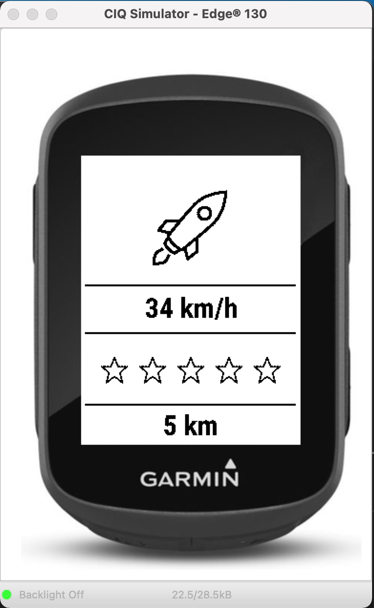

# Garmin Edge 130 Watch Face for Kids

I've come up with a new graphical interface (Watch Face) for my little MTB boys.
The speed is displayed in km/h or in increments of 5 using animal icons.
A star is shown on the display for every kilometer. 
After 5km the stars will be filled in with black. 
Over 10km a trophy will appear.

Setup
- 

Usage
-

Links
- 

Contribution
- 

To do
- 
