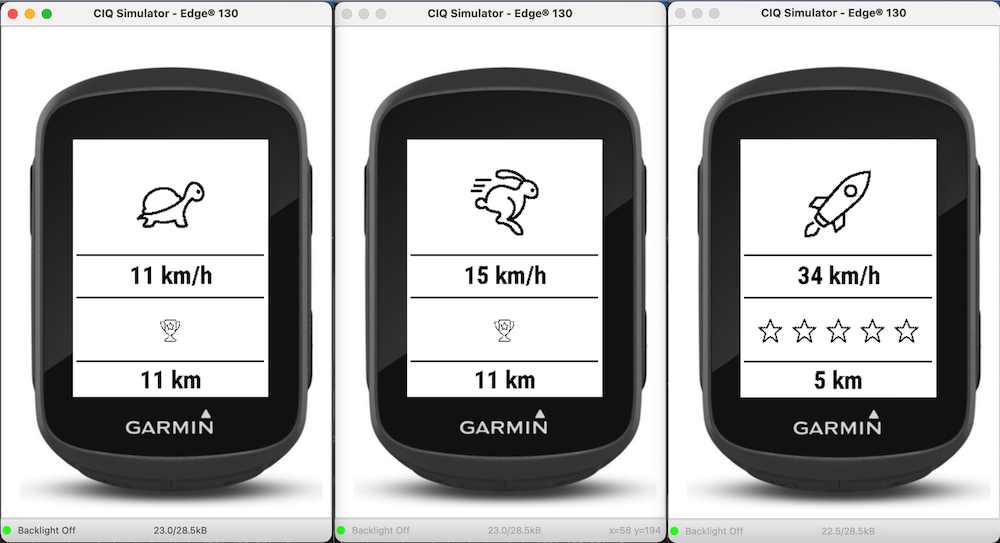

# Garmin Edge 130 Watch Face for Kids

I've come up with a new graphical interface (Watch Face) for my little MTB boys.

The speed is displayed in km/h or in increments of 5 using animal icons.

A star is shown on the display for every kilometer. 

After 5km the stars will be filled in with black. 

Over 10km a trophy will appear.

## Build App for use

Follow Programmer's Guide to setup your Windows or Mac.

Download Garmin Connect IQ SDK Manager.

Use the SDK manager to download the latest Connect IQ SDK and devices.

Once the download completes, click Yes when prompted to use the new SDK version as your active SDK.

Close the SDK Manager.

Install under Visual Studio Code the Monkey C Extension.

In VS Code, click Ctrl + Shift + P (Command + Shift + P on Mac) and select "Monkey C: build for device".
- Select were the .prg fiel should be stored.
- Choose Debig or Release (I am using debug).

Connect your device (Edge 130) with data cable to you PC/Mac and move the .prg file under APPS.

## Useful Documentation

https://developer.garmin.com/connect-iq/programmers-guide/

https://developer.garmin.com/downloads/connect-iq/monkey-c/doc/Toybox.html

https://developer.garmin.com/connect-iq/compatible-devices/

## Used Icons are all commercial free to use

- https://iconarchive.com/ 
